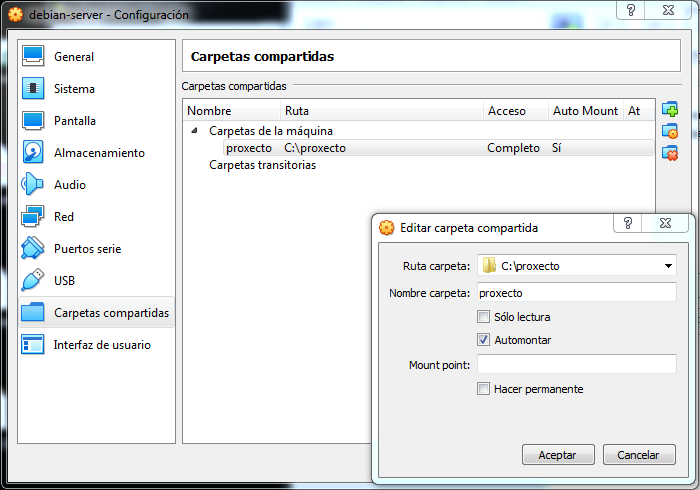
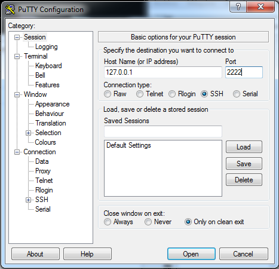

| [INICIO](../README.md)|          | [SEGUINTE](./02_APACHE)  |
| ------------- |:-------------:| -----:|

# MAQUINA VIRTUAL

### Usuarios e contrasinais
root : abc123
user : abc123
### Configuración maquina en virtualBox
Unha vez instalada a version "pelada" de debian , hai que facerlle unhas judiadas para facer as cousas mais rápido e que sexa funcional :
#### Erro o executar comandos con sudo
- [Referencia](https://devconnected.com/how-to-add-a-user-to-sudoers-on-debian-10-buster/)

Ainda que a nivel de seguridade , executar toda a configuracion como root , según os entendidos , é unha barrabasada , por se hai algun despiste , hai que engadir o usuario o arquivo /etc/sudoers, logueado como root :
~~~
$ nano /etc/sudoers
~~~
E engadir na derradeira liña:
~~~
user       ALL=(ALL:ALL) NOPASSWD:ALL
~~~

#### Guest Additions
- [Referencia](https://linuxize.com/post/how-to-install-virtualbox-guest-additions-on-debian-10/)

Priero , na mv , logueado como root :
~~~
$ sudo apt update
$ sudo apt install build-essential dkms linux-headers-$(uname -r)
~~~
*Ollo , $(uname -r) é unha varible que identifica o kernel , as veces , para algunha distribución este comando falla, , neste caso , subtituir directamente por buster:*
~~~
sudo apt install build-essential dkms linux-headers-buster
~~~

#### Carpeta compartida :
##### Modo rapido 
So lectura en mv 

- Estructura de carpetas compartidas : 

~~~
./proxecto
------------------------------------
./proxecto/servidor     confifuracion e proxecto qgis
-----------------------------------------------------------
./proxecto/qwc          cliente e servidor de servizos
-----------------------------------------------------------
~~~
##### Modo Voltas
- [Referencia](https://www.zeppelinux.es/montar-carpetas-compartidas-por-virtualbox-en-linux/)

### Openbox
Por se e preciso executar algo en entorno gráfico , instalase este xestor de ventanas , logo de instalar o servidor de X
https://wiki.debian.org/es/Openbox
### Mapeo portos
~~~
host    | guest  |servizo 
----------------------------------------------------
2222    | 22     | ssh
----------------------------------------------------
8050    | 80     | Apache 
----------------------------------------------------
8051    | 8081   | Visor modo desarrollo
----------------------------------------------------
~~~ 
### SSH
Para manexar a maquina virtual , xa que esta o non ter escritorio completo non permite o copiar / pegar , para a execucion dos comandos podese facer dende un cliente ssh , para esto :
#### Instalar servidor ssh na mv debian
####Cliente ssh windows

Duas opcions:

[Putty](https://www.chiark.greenend.org.uk/~sgtatham/putty/latest.html)

- Bash de git (Recomendada):
Abrir ventana de bahs git na carpeta compartida

~~~
$ ssh -l root localhost -p 2222

$ ssh-keygen -t rsa
$ cd /root/.ssh/
$ cat id_rsa.pub >> authorized_ke ys
$ chmod 600 authorized_keys
$ cp /root/.ssh/id_rsa /ruta_carpeta_compartida
$ exit
$ cp .id_rsa /c/Users/Sergio/.ssh/
~~~
