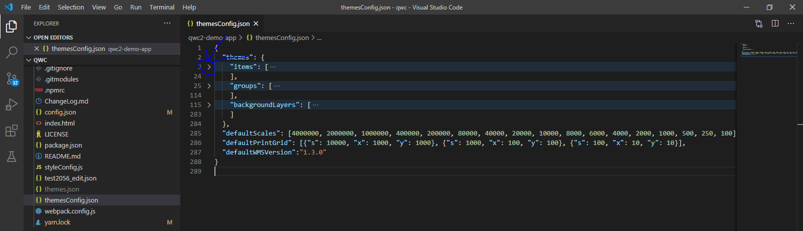
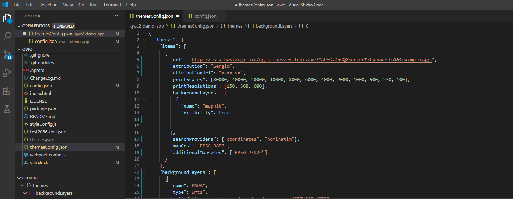

## Requerimentos
- [XAMMP](https://www.apachefriends.org/es/index.html)
- [osgeo installer]()
- [Node](https://nodejs.org/es/) 
- [Yarn](https://classic.yarnpkg.com/es-ES/docs/install#windows-stable)
- [Git](https://git-scm.com/downloads)
- IDE (Recomendable, pero podese amañar co notepad++) [Visual Studio Code](https://code.visualstudio.com/)

## Posta en marcha do cliente en modo desarrollo

Creo que para definir , o mellor e partir do exemplo de https://github.com/qgis/qwc2-demo-app para iso , unha vez instalado o anterior , seria 
1. Definir o espazo de traballo do visual studio
    1.  Abrir o visual studio e en arquivo ir a abrir carpeta  , dende ahi , pois creas unha carpeta en calquera sitio que che sexa comodo , e unha vez dentro daslle a seleccionar carpeta.
    2. Co editor aberto , no menu de terminal , seleccionas novo terminal , quedando o ide asi :
    

2. Descarga do exemplo e proba:
    1. No terminarl de VStudio escribes:
    ~~~
    $ git clone --recursive https://github.com/qgis/qwc2-demo-app.git
    ~~~
    Esto copian o proxecto e exemplo a carpeta onde tes aberto o VStudio
    
    2. Proba do proxecto:
    Primeiro hai que entrar dende a consola do VStudio a carpeta que se descargou con git
    ~~~
    $ cd qwc2-demo-app
    ~~~
    *Co tabulador autocompletas as rutas*
    
    Logo :
    ~~~
    $ yarn install
    ~~~
    Descarga paquetes e dependencias.
    Logo arrancas o servidor do cliente con:
    ~~~
    $ yarn start
    ~~~

    A consola quedaria algo como esto :

     

    Ahora , nun navegador escribirias :
    ~~~
    localhost:8081
    ~~~
    E abririase o proxecto de exemplo : 

    

    Para parar o servidor , na consola do visual studios , premese control + c , e aceptas:
    

## Trasteando e enlazado do proxecto QGIS

1. Engadindo a traduccion o español:

No arquivo /js/AppConfig.js : 

Engades no seguinte punto :
~~~
        "es":{
            code : "es-ES",
            description:"Espanol",
            localeData: require('react-intl/locale-data/es')
        }
~~~

2. ESPG ------ NON FUNCIONA!!!!!
Engadir o ETRS 89 no arquivo config.json engadindo: 
~~~
    {
      "code":"ESPG:25829",
      "proj":"+proj=utm +zone=29 +ellps=GRS80 +units=m +no_defs ",
      "label":"ETRS89 / UTM 29N"  
    },
~~~

3. Enlazar o proxecto qgis

No arquivo themesConfig.json.
Ten tres puntos de configuracion , items , que son os proxectos que carga por defecto , e themes que serian outros proxectos a cargar e backgroudlayer(capas base).

Aqui xa son cousas que tes que decidir segun sexa o a definición do proxecto , pero a priori , eu para probar , cargueime os grupos, configurei un item (proxecto ) , e engadin unha capa base do wms do IGN mapa base (co MTN e as ortos do PNOA)
- Enlazando o proxecto Qgis

Primeiro asegurate de ter o proxecto qgis definido nos seguintes puntos https://github.com/qgis/qwc2-demo-app/blob/master/doc/QWC2_Documentation.md#theme-configuration-qgis-projects-and-the-themesconfigjson-file

Logo :
~~~
    "items": [
      {
        "url": "http://localhost/cgi-bin/qgis_mapserv.fcgi.exe?MAP=C:%5CQGServer%5Cproxecto%5Cexemplo.qgs",
        "attribution": "Sergio",
        "attributionUrl": "xxxx.xx",
        "default":"true",
        "printScales": [80000, 40000, 20000, 10000, 8000, 6000, 4000, 2000, 1000, 500, 250, 100],
        "printResolutions": [150, 300, 600],
        "backgroundLayers": [
          {
            "name": "base_ign"
          },
          {
            "name": "mapnik",
            "visibility": true
          }
        ],
        "searchProviders": ["coordinates", "nominatim"],
        "mapCrs": "EPSG:3857",
        "additionalMouseCrs": ["EPSG:25829"]
      }
    ],
~~~

*A imaxe e para ver onde vai encastrada a configuracion, fiate do codigo non da imaxe*

Onde tes que modificar a url como segue:

http://localhost/cgi-bin/qgis_mapserv.fcgi.exe?MAP=

E a continuación a ruta do proxecto qgis , cambiando as barras \ por %5C

- Engadino capa base wms

Os parametros saqueinos do getcapabilities do servizo : 

~~~
      {
        "name":"base_ign",
        "type":"wms",
        "url":"https://www.ign.es/wms-inspire/ign-base",
        "params":{
          "LAYERS":"IGNBaseOrto",
          "STYLES":"default"
        },
        "title":"Base IGN",
        "srs": "EPSG:3857"
      },
~~~

- Compilando as configuracions
Logo hai que executar na consola de visual estudio na carpeta da demo como antes (ollo, ten que estar o servizo de apache activado e correndo no XAMPP) :
~~~
$ yarn run themesconfig
~~~
e logo
~~~
$ yarn start
~~~

no navegador localhost:8081 : 

